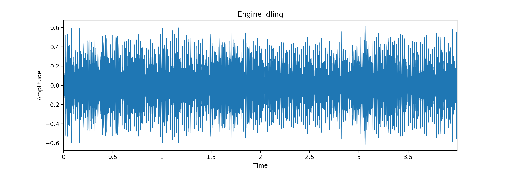
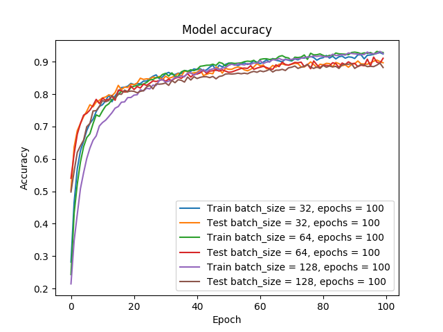

**This is an on-going project in which I aim to create a program which can accurately classify common urban sounds, and detect idling engines in the hope that it could be employed in tackling offending vehicles as part of the recent government initiatives to impose "no idling" zones.**

# Audio Classifier for Idling Engine Sounds

## Setup
This project requires Python 3 and the following packages:
```
pandas
librosa
glob
matplotlib
numpy
scipy
keras
tensorflow
```

NB The Training Set used is not included in this repository due to the large file size, however it can be downloaded for free from:
https://datahack.analyticsvidhya.com/contest/practice-problem-urban-sound-classification/

## Load and Plot Waveform

- The file ```Plot_Audio_Data.py``` can be used to show a plot of the waveform for sounds in the training set. The plot below shows the waveform for an Idling Engine recording.



## Multi-Class Classification using Neural Network

Using a sequential model with 2 hidden layers, I was able to achieve a maximum accuracy of 51% in the cross-validation set.
However, removing one of the hidden layers gave a much improved accuracy of 71% in the cross-validation set.
Moving on from this, I decided to try using a convoluted neural network on a Mel Frequency Spectogram of the audio clips.

By increasing the number of Epochs to 50, I managed to increase the accuracy to 88% in the cross-validation set.

The next step is to try implementing a **Convolutional Neural Network** in order to hopefully increase the accuracy to ~100%

## Evalutation of Dataset

The dataset contains the following distribution of data:

- Sample size:
  5434

- 10 different labels:
  siren
  street_music
  drilling
  dog_bark
  children_playing
  gun_shot
  engine_idling
  air_conditioner
  jackhammer
  car_horn

- Number of samples per label (descending order):
  'jackhammer': 668
  'engine_idling': 624
  'siren': 607
  'street_music': 600
  'drilling': 600
  'dog_bark': 600
  'children_playing': 600
  'air_conditioner': 600
  'car_horn': 306
  'gun_shot': 230

The plot below shows the performance of the algorithm on the training and validation sets respectively, for varying hyperparameters of batch size and number of epochs.


